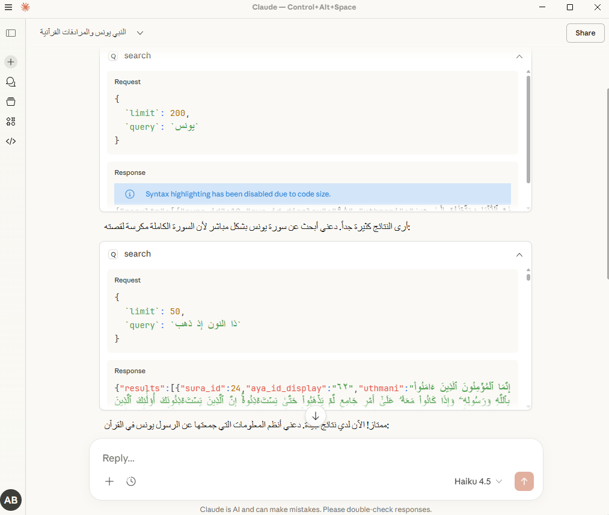

# Quran Search Engine MCP

[](https://www.npmjs.com/package/quran-search-engine-mcp)
[](https://github.com/modelcontextprotocol/servers)
[](LICENSE)
[](https://github.com/adelpro/quran-search-engine)

I developed **quran-search-engine-mcp** to bridge the gap between AI and authentic Quranic text.



The idea is simple: instead of relying on an AI to "hallucinate" or predict Quranic verses, this tool routes search requests to a dedicated, accurate search engine. The AI handles the natural language understanding, while the MCP server provides the exact, literal Quranic text.
This means the AI only processes the query, while the Quranic text is always accurate.

## Features

- 🔌 **MCP Compatible**: Works seamlessly with Claude Desktop and other MCP clients.
- 🔍 **Advanced Search**: Supports Arabic normalization, lemma, and root-based search.
- 📖 **Accurate Results**: Returns exact verses with no hallucinations.
- 📄 **Pagination**: Handles large result sets with pagination.
- ✨ **Highlights**: Clearly marks matched terms.

## Configuration (Claude Desktop)

### Option 1: Quick Start (Recommended for Users)

You can use the published package directly without building it yourself.

1. Edit the config file:
   - **Windows**: `%APPDATA%\Claude\claude_desktop_config.json`
   - **macOS**: `~/Library/Application Support/Claude/claude_desktop_config.json`

2. Add the server entry:

```json
{
  "mcpServers": {
    "quran-search-engine-mcp": {
      "command": "npx",
      "args": ["quran-search-engine-mcp"]
    }
  }
}
```

1. Restart Claude Desktop.

### Option 2: Local Development (For Contributors)

1. Build the server:

```bash
pnpm build
```

1. Edit the config file:
`%APPDATA%\Claude\claude_desktop_config.json`

2. Add the server entry:

```json
{
  "mcpServers": {
    "quran-search-engine-mcp": {
      "command": "node",
      "args": ["D:\\path\\to\\quran-search-engine-mcp\\dist\\server.js"]
    }
  }
}
```

*Note: Replace `D:\\path\\to\\...` with the actual absolute path to your project.*

1. Restart Claude Desktop.

## Usage

Once configured, you can use it in chat:

“Search the Quran for الحمد and show the results.”

Result: any Quran-related query is sent directly to the server, and the server returns the correct verses.

## Usage Example: Searching for Prophet Yunus

The engine understands context and synonyms. For example, when searching for **"Prophet Yunus with all synonyms"**:

> "Search for the Prophet Yunus with all synonyms"

The result includes verses related to **Yunus**, **The People of Yunus**, and even **Dhul-Nun** (The One with the Whale).


Even when restricting the search to the name only, the results remain precise. This proves that the AI understands the intent, but the data comes from a trusted source.

## Uses quran-search-engine

This server builds on the quran-search-engine package for core search logic, Arabic normalization, lemma/root matching, and highlights.  
See <https://www.npmjs.com/package/quran-search-engine> for details.

## Conclusion

**quran-search-engine-mcp** turns any MCP-compatible AI into a reliable source for Quranic search.
Everything goes through the server, the texts are always correct, and the AI only handles the query.

This opens the door for educational applications, smart assistants, or any project that needs trustworthy, realistic Quran search without hallucinations.

---

## Requirements

- Node.js LTS
- pnpm

## Install

```bash
pnpm install
```

## Build

```bash
pnpm build
```

## Local Development

```bash
pnpm dev
```

## Test

```bash
pnpm test
```

## Lint

```bash
pnpm lint
```

## Publish

```bash
pnpm build
pnpm version patch
pnpm publish --access public
```

## Contribute

See [CONTRIBUTING.md](CONTRIBUTING.md).

## Contact

Email: <contact@adelpro.us.kg>

## License

MIT
