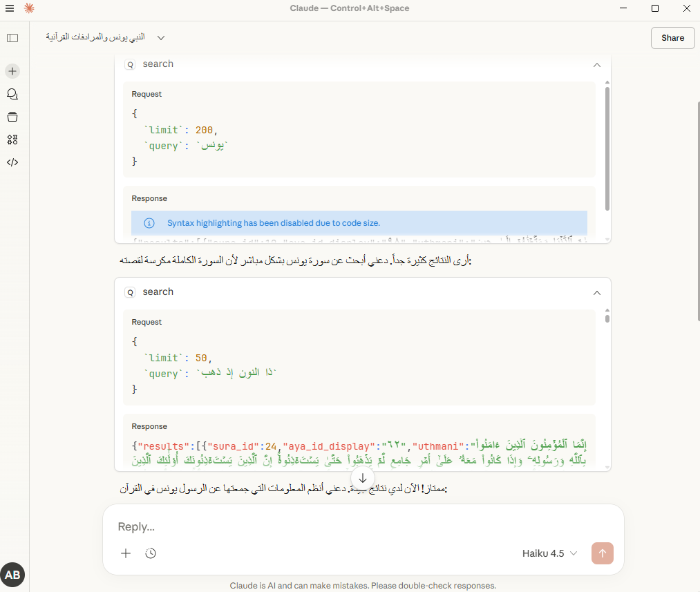

# Quran Search Engine MCP

[](https://www.npmjs.com/package/quran-search-engine-mcp)
[](https://github.com/modelcontextprotocol/servers)
[](LICENSE)
[](https://github.com/adelpro/quran-search-engine)

I developed **quran-search-engine-mcp** to bridge the gap between AI and authentic Quranic text.



The idea is simple: instead of relying on an AI to "hallucinate" or predict Quranic verses, this tool routes search requests to a dedicated, accurate search engine. The AI handles the natural language understanding, while the MCP server provides the exact, literal Quranic text.
This means the AI only processes the query, while the Quranic text is always accurate.

## Features

- 🔌 **MCP Compatible**: Works seamlessly with Claude Desktop, ChatGPT, Cursor, VS Code, and other MCP clients.
- 🌐 **Two Transports**: Stdio for local desktop integrations, and **Streamable HTTP** for remote/cloud connectors (ChatGPT, hosted Claude, Smithery, etc.).
- 🔍 **Advanced Search**: Supports Arabic normalization, lemma, and root-based search.
- 📖 **Accurate Results**: Returns exact verses with no hallucinations.
- 📄 **Pagination**: Handles large result sets with pagination.
- ✨ **Highlights**: Clearly marks matched terms.
- 🛡️ **Hardened HTTP**: Host allow-list, per-IP rate limiting, request body size cap, idle session reaper, and `/health` endpoint out of the box.

## Transports

The server exposes the same MCP `search` tool over two transports, selected at startup:

| Transport | When to use | Default endpoint | Selection |
| --- | --- | --- | --- |
| `stdio` | Local AI clients | stdio pipes | `TRANSPORT=stdio` (default) |
| `http` | Remote MCP clients | `http://host:port/mcp` + `/health` | `TRANSPORT=http` or `--http` |

Both transports expose the same tool surface — the only thing that changes is how the client reaches the server.

### HTTP Transport

When `TRANSPORT=http` is set (or `--http` is passed), the server starts an HTTP listener using the MCP **Streamable HTTP** transport. The following endpoints are exposed:

- `POST /mcp` — initialize new sessions and send JSON-RPC requests
- `GET /mcp` — server-sent events for streaming responses
- `DELETE /mcp` — close a session
- `GET /health` — `{"status":"ok","dataLoaded":true,"version":"…","sessions":N}`

Environment variables (with defaults):

| Variable | Default | Description |
| --- | --- | --- |
| `TRANSPORT` | `stdio` | `stdio` or `http` |
| `PORT` | `4000` | HTTP listen port |
| `HOST` | `0.0.0.0` | HTTP bind address |
| `MCP_ALLOWED_HOSTS` | _(unset)_ | Comma-separated `Host` header allow-list |
| `MCP_SESSION_TTL_MS` | `300000` | Idle session TTL (ms) |
| `MCP_MAX_SESSIONS` | `500` | Concurrent session cap |
| `MCP_MAX_BODY_BYTES` | `1048576` | Max request body size (bytes) |
| `MCP_RATE_LIMIT_PER_MINUTE` | `60` | Per-IP request cap |

Quick start (local HTTP):

```bash
TRANSPORT=http PORT=4000 npx quran-search-engine-mcp
# → "Quran MCP HTTP server listening on http://0.0.0.0:4000/mcp"
curl http://127.0.0.1:4000/health
# → {"status":"ok","dataLoaded":true,"version":"0.4.0","sessions":0}
```

A ready-to-run `docker-compose.yml` is included (see [Docker](#docker) below).

## Configuration by Client

Pick the section that matches your AI client. All HTTP examples assume the server is reachable at `http://localhost:4000/mcp` (the default after `docker compose up` or `yarn dev:http`).

### Claude Desktop

Claude Desktop supports both transports. Edit the config file at:

- **Windows**: `%APPDATA%\Claude\claude_desktop_config.json`
- **macOS**: `~/Library/Application Support/Claude/claude_desktop_config.json`
- **Linux**: `~/.config/Claude/claude_desktop_config.json`

**Option 1 — Stdio (simplest, no extra process):**

```json
{
  "mcpServers": {
    "quran-search-engine-mcp": {
      "command": "npx",
      "args": ["-y", "quran-search-engine-mcp"]
    }
  }
}
```

**Option 2 — HTTP (point at an already-running server):**

Start the server separately (`yarn dev:http` or `docker compose up`), then add:

```json
{
  "mcpServers": {
    "quran-search-engine-mcp-http": {
      "url": "http://localhost:4000/mcp"
    }
  }
}
```

Restart Claude Desktop after editing the config.

### ChatGPT (Connectors)

ChatGPT's **Connectors** feature speaks MCP-over-HTTP. The server must be reachable from ChatGPT's network.

1. Run the server on a publicly reachable host:

   ```bash
   TRANSPORT=http HOST=0.0.0.0 PORT=4000 \
     MCP_ALLOWED_HOSTS=chat.openai.com,chatgpt.com \
     npx quran-search-engine-mcp
   ```

   Or deploy with `docker compose up` behind a TLS-terminating reverse proxy.
2. In ChatGPT → **Settings** → **Connectors** → **Add connector**, choose **Custom MCP server**.
3. Enter your public URL, e.g. `https://quran-mcp.example.com/mcp`.
4. Approve the `search` tool when prompted.

### Cursor

Cursor reads MCP servers from `~/.cursor/mcp.json` (or per-project `.cursor/mcp.json`).

**Stdio:**

```json
{
  "mcpServers": {
    "quran-search-engine-mcp": {
      "command": "npx",
      "args": ["-y", "quran-search-engine-mcp"]
    }
  }
}
```

**HTTP:**

```json
{
  "mcpServers": {
    "quran-search-engine-mcp-http": {
      "url": "http://localhost:4000/mcp"
    }
  }
}
```

### VS Code (GitHub Copilot Chat)

VS Code reads MCP servers from `.vscode/mcp.json` in your workspace (or `settings.json` for user-wide).

```json
{
  "servers": {
    "quran-search-engine-mcp": {
      "type": "http",
      "url": "http://localhost:4000/mcp"
    }
  }
}
```

For a stdio-only setup, omit `type`/`url` and supply `command` + `args` instead.

### Other MCP Clients (Cline, Continue, Roo Code, Zed, MCP Inspector, …)

The server follows the standard MCP wire protocol, so any client that supports either `stdio` or `streamable-http` transports works:

- **Stdio**: spawn `npx -y quran-search-engine-mcp` (or `node /path/to/dist/server.js`).
- **HTTP**: point the client at `http://localhost:4000/mcp` after starting the server in HTTP mode.

For **MCP Inspector** (handy for debugging):

```bash
npx @modelcontextprotocol/inspector --url http://localhost:4000/mcp
```

### Smithery

This server is published on Smithery as `io.github.adelpro/quran-search-engine-mcp`. Use the `npx -y quran-search-engine-mcp` invocation from the Smithery UI; the stdio transport is what Smithery's hosted runner expects.

## Usage

Once configured, you can use it in chat:

"Search the Quran for الحمد and show the results."

Result: any Quran-related query is sent directly to the server, and the server returns the correct verses.

## Usage Example: Searching for Prophet Yunus

The engine understands context and synonyms. For example, when searching for **"Prophet Yunus with all synonyms"**:

> "Search for the Prophet Yunus with all synonyms"

The result includes verses related to **Yunus**, **The People of Yunus**, and even **Dhul-Nun** (The One with the Whale).


Even when restricting the search to the name only, the results remain precise. This proves that the AI understands the intent, but the data comes from a trusted source.

## Docker

The repo includes a hardened multi-stage `Dockerfile` and `docker-compose.yml` that run the server in HTTP mode on port `4000`.

```bash
docker compose up --build
# → "Quran MCP HTTP server listening on http://0.0.0.0:4000/mcp"
```

The container runs as the unprivileged `node` user, binds `127.0.0.1:4000` by default, and exposes a `/health` endpoint for Docker healthchecks. Tweak `docker-compose.yml` to bind on `0.0.0.0` and set `MCP_ALLOWED_HOSTS` if you put it behind a reverse proxy.

## Uses quran-search-engine

This server builds on the quran-search-engine package for core search logic, Arabic normalization, lemma/root matching, and highlights.
See <https://www.npmjs.com/package/quran-search-engine> for details.

## Conclusion

**quran-search-engine-mcp** turns any MCP-compatible AI into a reliable source for Quranic search.
Everything goes through the server, the texts are always correct, and the AI only handles the query.

This opens the door for educational applications, smart assistants, or any project that needs trustworthy, realistic Quran search without hallucinations.

---

## Requirements

- Node.js 20+ (LTS recommended)
- npm, pnpm, or yarn

## Install

```bash
yarn install
# or: npm install / pnpm install
```

## Build

```bash
yarn build
```

## Local Development

```bash
yarn dev           # stdio transport
yarn dev:http      # HTTP transport on http://localhost:4000/mcp
```

## Test

```bash
yarn test
```

This runs `pretest` (version-consistency check), then exercises the `search` tool end-to-end over both stdio and HTTP transports.

## Lint

```bash
yarn lint          # check
yarn lint:fix      # autofix
```

## Publish

```bash
yarn build
yarn version patch
yarn publish --access public
```

## Contribute

See [CONTRIBUTING.md](CONTRIBUTING.md).

## Contact

Email: <contact@adelpro.us.kg>

## License

MIT
